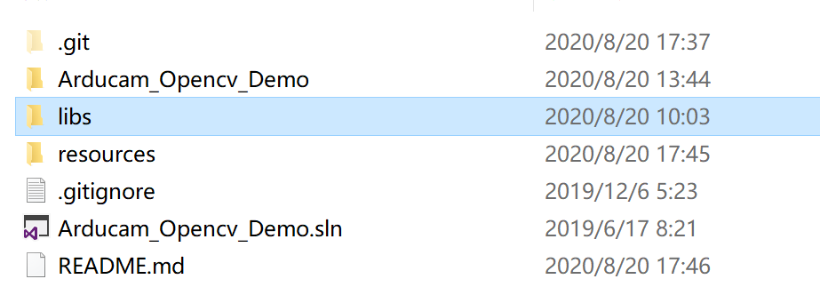

# Introduction

## Windows

The library file is too big, I put it in the release.   
You can download it separately, the directory structure is as follows:  


## Linux

## Installation dependence

1. opencv
2. arducam-usb-sdk-dev
3. arducam-config-parser-dev

```
sudo apt install libopencv-dev

curl -s --compressed "https://arducam.github.io/arducam_ppa/KEY.gpg" | sudo apt-key add -
sudo curl -s --compressed -o /etc/apt/sources.list.d/arducam_list_files.list "https://arducam.github.io/arducam_ppa/arducam_list_files.list"
sudo apt update
sudo apt install arducam-config-parser-dev arducam-usb-sdk-dev
```

### Build

```
mkdir build && cd build
cmake ..
make -j2
```

### Run

```
./Arducam_Opencv_Demo <path/config-file-name>
```